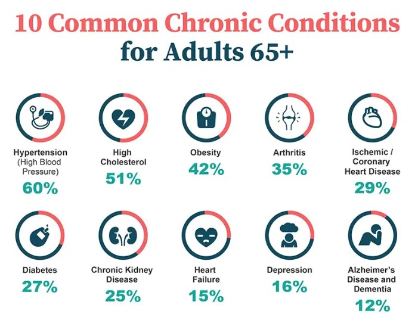

{}

```{r}
#| label: load-pkgs
#| code-summary: "Packages"
#| echo: false
#| message: false
#| warning: false

library(wbstats)    # for data
library(tidyverse)  # for data wrangling
library(knitr)      # for tables
library(viridis)
library(formattable)
library(plotly)
```

## Introduction

Over the last two decades, the populations of most countries have been aging steadily. The United Nations Population Fund ([UNFPA])(https://www.unfpa.org/ageing) projects that between 2024 and 2074, this number is expected to increase even further. While developed countries today have the highest share of older persons, developing countries such as the ECCU are also witnessing a rapid rate of population aging, and many governments may not be fully prepared for these new realities. This brief considers the trends in the elderly population in the ECCU in the past four decades, and the causes and potential consequences of an aging population, with a focus on the elderly. The elderly population is defined as the share of the population aged 65 years and over. This indicator is used in the calculation of the dependent population. The dependent population is the part of the population that does not work and relies on others for the goods and services they consume. 

## Trends

The Eastern Caribbean Currency Union (ECCU) has seen a significant rise in its elderly population since the 1980s. For instance, the percentage of residents aged 65 and over nearly doubled, in countries such as Dominica and Grenada.  In Grenada, the percentage of elderly grew from 6.4 per cent in 1980 to 11.5 per cent in 2022, while in Dominica, it grew from 7.0 per cent in 1980 to 12.6 per cent in 2022 (Figure 1 and 2). Figure 2 presents a heatap for the six independent ECCU member countries highlighting themost recent trends. 

```{r}
#| echo: false
#| warning: false
#| label: fig-aging
#| fig-cap: "Trends in ECCU Aging"
#| fig-subcap:
#|   - "Line chart"
#|   - "Heat Map" 
#| layout-ncol: 2

aging_ec <- wb_data('SP.POP.65UP.TO.ZS', 
                    country = c("LCA","ATG", "VCT", "GRD", "KNA", "DMA"), 
                    start_date = 1980 , 
                    end_date = 2022)
aging_ec <- aging_ec %>% dplyr::select(country, iso3c, date, SP.POP.65UP.TO.ZS) %>% 
  dplyr::rename(aged65 = SP.POP.65UP.TO.ZS) #change variable name
aging_ec$aged65 <- formattable::digits(aging_ec$aged65, digits = 1) #decimal plces
ggplot(aging_ec, aes(x = date, y = aged65, color = country)) +
  geom_line(size=1.5) +
  labs(x = "", 
       y = "%", 
       title = "Figure 1: Trends in Elderly Population in the ECCU",
       caption = "Source: United Nations via wbstats",
       color = "Country") +
  scale_color_manual(values = c("#04078f", "#2e86ab", "#F5CA45", "#565554", "#458f04","#f24236"), name = "Country")+
  theme_minimal()+
  theme(legend.position = "bottom",
        axis.text = element_text(color = "black"),
        plot.title = element_text(size = 12, color = "grey50", face = "bold", hjust = 0.5),
        plot.subtitle = element_text(size = 9, color = "grey20", face = "italics"),
        legend.title = element_blank())

# Create shorter subset from 2005
aged_ec_2005 <- subset(aging_ec, date >= 2005)
aged_ec_2005$aged65 <- formattable::digits(aged_ec_2005$aged65, digits = 1)

# HEATMAP
ggplot(aged_ec_2005, aes(x = as.factor(iso3c), y = date, fill = aged65)) +
  geom_tile(colour = "white", lwd = 1) +
  geom_text(aes(label = aged65), color = "white", size = 3) +
  coord_cartesian(ylim = c(2005, 2022)) +
  scale_fill_viridis() +
  guides(fill = guide_colourbar(barwidth = 0.5))+
  labs(
    title = "Figure 2: Aging in the ECCU: \nPercentage of Persons aged 65 and over", 
    subtitle = "2005 - 2022",
    caption = "Source: United Nations via webstats") +
  scale_x_discrete(expand = c(0, 0)) +
  theme(text = element_text(size = 8),
        plot.title = element_text(size = 12, color = "grey20", face = "bold", hjust = 0.5),
        plot.subtitle = element_text(size = 9, color = "grey20"),
        legend.title = element_blank(),
        axis.title = element_blank(),
        axis.text.y = element_text(hjust = 0),
        axis.ticks = element_blank())
```

This increase in the elderly population is coupled with overall population decline in a few ECCU member countries (Figure 3). This combination of an aging population and declining population growth may result in some significant challenges. For instance, as the percentage of older people rises, the number of working-age individuals available to support them may decline (this may not be the case for all ECCU countries at this time). This imbalance may put a strain on social safety nets like social security systems, and healthcare, as well as the broader economy.  A shrinking population (especially declining workforce) may find it difficult to sustain economic output, while the rising costs of caring for a larger elderly population can put pressure on governments' budgets and social support systems.

```{r}
#| echo: false
#| warning: false
#| label: fig-pop
#| fig-cap: "Population Growth Trends in Selected Countries"

popgrw <- wb_data("SP.POP.GROW", 
                  start_date = 2000, end_date = 2023)
popgrw_all <- popgrw |>
  select(iso3c, country, date, SP.POP.GROW) %>% 
  mutate(across(c('SP.POP.GROW'), round, 1)) %>% 
  arrange(-SP.POP.GROW) %>% 
  rename(`Pop.Growth`=SP.POP.GROW,
         `Country`=country,
         `Year`=date)
pop<- popgrw_all %>%
  group_by(Country, iso3c) %>%
  summarise(mean = mean(Pop.Growth))
pop$mean <- formattable::digits(pop$mean, digits = 1)

select_iso <- c("ASM", "ABW", "BLZ", "VGB", "CUB", "CHL",
           "DMA", "SLV", "FI", "FJI", "GRD", "IND",
           "JAM", "MHL", "MUS", "SXM", "SGP", "LCA",
           "KNA", "VCT", "TTO", "VUT", "BHS", "BRB", "ATG", "GDA")

popgrw_select<-ggplot(subset(pop, iso3c %in% select_iso), aes(reorder(Country, mean), mean)) + 
  geom_bar(aes(fill = ifelse(iso3c %in% c("ATG", "DMA","GRD", "KNA", "LCA", "VCT"), "eccu", "default"),
               text = paste("Country:", Country, "<br>mean:", mean)), stat="identity")+
  scale_fill_manual(values = c(eccu = "steelblue", default = "skyblue")) +
  coord_flip()+
  labs(x = NULL,
       y= "Avg pop growth",
       title = "Figure 3: Avg Population Growth in Selected Countries, \n2000-2022")+
  theme_minimal()+
  theme(legend.position = "none")
ggplotly(popgrw_select, tooltip = "text")
```

Understanding the interconnectedness of these demographic shifts is therefore essential for developing effective strategies that support an aging population while ensuring future prosperity.

## Causes

Several related factors contribute to the phenomenon of population aging. Perhaps the most significant is the sustained increase in life expectancy, largely due to advancements in healthcare, sanitation, and nutrition. People are living longer, resulting in a larger proportion of older individuals within the population. At the same time, fertility rates have been declining globally.  

Smaller family sizes, often driven by increased access to education and contraception, as well as changing societal norms, mean fewer children are being born, further shifting the population balance towards older age groups. These two trends, increased longevity and decreased fertility, combine to create the aging population dynamic observed in many countries worldwide. 


## Implications

These shifting demographics significantly impact public and private spending across various sectors, including pensions, healthcare, and education, ultimately affecting economic growth and overall well-being. The aging population, in particular, will strain healthcare budgets and drive up the need for long-term care. A key challenge lies in meeting the increasingly complex healthcare requirements of the elderly and ensuring the healthcare system is equipped to provide quality and equitable care to this expanding demographic.




This challenge is compounded by a growing shortage of healthcare professionals which has emerged globally. The current supply of qualified doctors, nurses, pharmacists, social workers, and technicians is insufficient to meet the rising demand. Research by the National Council of Aging ([NCOA](https://www.ncoa.org/article/the-inequities-in-the-cost-of-chronic-disease-why-it-matters-for-older-adults/)) found that 94.9 per cent percent of adults age 60 and older have at least one condition, while 78.7 per cent have two or more. Some of the most common chronic conditions include obesity, hypertension, dementia, and heart disease.

The financial burden of this aging shift is likely be substantial. Research by [Jones and Dolsten](https://pubmed.ncbi.nlm.nih.gov/38582901/) (2024) found that the healthcare systems in the US (and globally) may not be fully eqipped to handle the increased demands of an aging population. These systems are affected by fragmentation, inefficiency, and high costs, with gaps in coordination, quality, and accessibility.

Climate change may further exacerbate these health risks for the elderly. Older adults are particularly vulnerable to environmental hazards due to age-related physiological changes that make it harder for their bodies to adapt. Pre-existing conditions can be worsened by climate-related hazards like heat and air pollution. Limited mobility increases risks during extreme weather events. Compromised immune systems make older adults more susceptible to diseases spread by insects and water, which may become more prevalent due to climate change. Finally, reliance on others for care and daily assistance makes them even more vulnerable during extreme weather.

